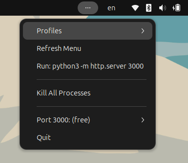
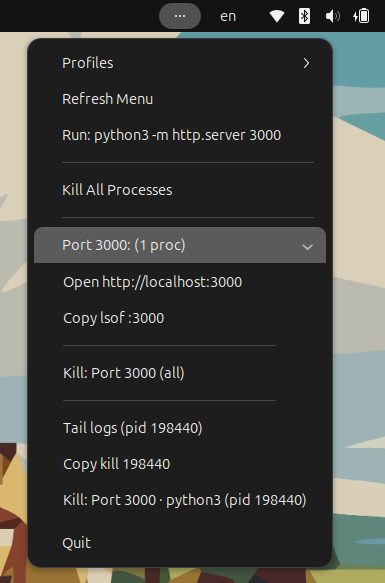

# Port Warden — Tray App for Dev Ports (Rust)

A tiny cross‑platform tray app to **see, free, and relaunch ports** used by your dev stack. Built with **Rust**, **netstat2**, **sysinfo**, and optional **Docker** awareness.

## Preview

 


## ✨ Features

* **Project profiles** via `.portkill.json` (monorepo‑friendly). One click kills a whole group.
* **Container‑aware**: shows `docker-proxy → container:name`, with **Kill/Restart** for containers (via `bollard`).
* **Kill** per port: heuristics detect **docker compose**, **npm/yarn/pnpm**.
* **Smart & safe kill**: escalates **SIGTERM → SIGINT → SIGKILL** with timeouts; **protected ports** (5432, 6379, 3306, 27017) ask for confirmation.
* **Local HTTP API**: `POST /kill?port=3000`, `POST /profile/<name>/kill` for VS Code tasks or git hooks.
* **Open & Inspect**: *Open [http://localhost\:PORT](http://localhost:PORT)*, *Tail logs* (last \~200 lines, Linux/macOS), *Copy* `lsof` / `kill` commands.
* **Monitoring & alerts**: per‑PID **CPU/RAM** alerts (Linux only for now).
* **Human names for known ports**: 9000 → MinIO, 9001 → MinIO Console, 15672 → RabbitMQ UI, 7700 → Meilisearch, 8080 → Nginx.
* **CLI mode** (no GUI): list/kills from a terminal or CI.

---

## 📦 Project layout

```
port-warden/
├─ Cargo.toml
├─ README.md
├─ src/
│  └─ main.rs
└─ .portkill.json        # optional per-project profiles
```

**Sample `.portkill.json`**

You can use this using the next command:
```bash
cp .portkill.json.example .portkill.json
```

```json
{
  "default_profile": "python_server",
  "profiles": {
    "docker_compose": {
      "ports": [3000, 5000, 6379, 9000, 15672],
      "cwd": ".",
      "start": "docker compose up -d",
      "stop": "docker compose down"
    },
    "python_server": {
      "ports": [3000],
      "cwd": ".",
      "start": "python3 -m http.server 3000"
    },
    "node_server": {
      "ports": [3000],
      "cwd": "./backend",
      "start": "npm run dev"
    },
    "db": { "ports": [5432, 3306] },
    "docker_single": { 
      "ports": [5432],
      "start":"docker run --name demo-postgres -p 5432:5432 -e POSTGRES_PASSWORD=demo -d postgres",
      "stop":"docker rm -f demo-postgres"
    }
  }
}
```

How it works:

* The app searches for `.portkill.json` **from `cwd` upwards** until found.
* The active profile is `default_profile`; otherwise, it falls back to `PORTKILL_PORTS`.
* Parameter **start** and **stop** can be used when kill by process doesnt work.
* When a container is discover this app add new two options to Restart and Kill container.

---

## 🛠️ Install & run

### System dependencies

* **Linux (tray support)**

  ```bash
  sudo apt update
  sudo apt install -y pkg-config libgtk-3-dev libayatana-appindicator3-dev libssl-dev
  ```
* **macOS / Windows**: only `rustup` stable toolchain.

### Build & run

```bash
# Run with GUI (tray)
cargo run --features gui

# Console mode (CLI)
PORTKILL_MODE=cli cargo run -- list
```

> Tip: create an alias `portkill`, or build a release binary with `cargo build --release`.

---

## 🧩 Tray usage (what you’ll see)

Open the **system tray** menu. You’ll find:

### Profiles

* **Profiles → Reload profiles**: re-read `.portkill.json` after edits.
* **Profiles → ● name**: switch active profile.
* **Run / Stop**: if the profile defines `start`/`stop`, run those in `cwd`.

### Global

* **Kill All Processes**: kill every PID occupying ports in the active profile.
* **Quit**: exit the app.

### Per‑port actions

For each port listed by the profile:

* **State**: *(free)* when no process/container is bound; or a list of PIDs/containers.
* **Open [http://localhost\:PORT](http://localhost:PORT)**
* **Copy lsof \:PORT**
* **Tail logs (pid …)** *(Linux/macOS)*
* **Kill: Port PORT (all)** and **Kill: Port PORT · NAME (pid PID)**

### Containers

If a port is exposed by Docker, you’ll see entries like `container:name`:

* **Restart container name** / **Delete container name**.
* “Core” services are handled more cautiously.

## 🧯 Smart kill & protected ports

* Kill escalation: **SIGTERM → wait → SIGINT → wait → SIGKILL** (POSIX). On Windows, a best‑effort termination via `sysinfo` is used.
* **Protected ports**: `5432, 6379, 3306, 27017` require explicit confirmation or `confirm=1` via API.

## 🔌 Local HTTP API (for VS Code & git hooks) (With GUI Only)

Opt-in: start the API only when launching the GUI with `--api`. Default bind is `127.0.0.1:7077` (override with `PORTKILL_API_PORT`). **POST** endpoints:

* **Kill by port**

  ```bash
  curl -X POST "http://127.0.0.1:7077/kill?port=3000"
  # protected ports → confirm
  curl -X POST "http://127.0.0.1:7077/kill?port=5432&confirm=1"
  ```
* **Kill by profile**

  ```bash
  curl -X POST "http://127.0.0.1:7077/profile/[PROFILE]/kill"
  ```

Run with API enabled (GUI):

```bash
cargo run --features gui -- --api

# custom port
PORTKILL_API_PORT=9090 cargo run --features gui -- --api
```

**VS Code idea**: a Task/extension that calls **/kill** before launching `npm run dev` (remember `--api`).
**Git hook** *(post-checkout)*: free ports when switching branches.

```bash
#!/usr/bin/env bash
curl -s -X POST "http://127.0.0.1:7077/kill?port=3000" >/dev/null || true
```

---

## 📈 Monitoring & alerts (With GUI Only)

* Per‑PID alerts if **CPU** or **RAM** exceed thresholds for 3 consecutive ticks. (Linux only for now.)
* Tweak via env vars:

  * `PORTKILL_REFRESH` (seconds; default `2`)
  * `PORTKILL_CPU` (percentage; default `90`)
  * `PORTKILL_MEM_MB` (MB; default `1024`)

Run with alerts enabled (GUI):

```bash
cargo run --features gui -- --alerts

# Quick test with low thresholds
PORTKILL_REFRESH=1 PORTKILL_CPU=1 PORTKILL_MEM_MB=1 \
  cargo run --features gui -- --alerts
```
---

## ⌨️ CLI mode

Perfect for CI/SSH.

```bash
# list according to active profile
PORTKILL_MODE=cli cargo run -- list

# kill all processes bound to profile ports
PORTKILL_MODE=cli cargo run -- kill-all

# kill by port
PORTKILL_MODE=cli cargo run -- "kill:5000"
```

---

## ⚙️ Environment variables

* `PORTKILL_PORTS` → default list when there is no `.portkill.json`, e.g. `"3000,5000,8080"`.
* `PORTKILL_REFRESH` → scan interval in seconds (default `2`).
* `PORTKILL_API_PORT` → local API server port (default `7077`).
* `PORTKILL_CPU`, `PORTKILL_MEM_MB` → monitoring thresholds.

---

## 🧪 Troubleshooting

* **Tray icon missing (Linux)**: ensure `libayatana-appindicator3-dev` is installed.
* **Docker permissions**: if containers aren’t listed, check access to `/var/run/docker.sock`. On Linux, add your user to the `docker` group and re‑login.
* **macOS logs**: *Tail logs* uses `log show` (may be slow the first time).
* **Windows**: POSIX signals are not available; *Tail logs* not supported.
* **VS Code integration**: test the endpoint with `curl` and check your firewall.
